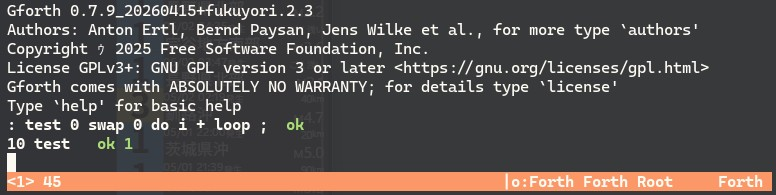

# Gforth README

This repository is a fork of
[forthy42/gforth](https://github.com/forthy42/gforth) that has been modified so
Gforth can be built, run, and packaged natively on Windows.  It is currently
based on `Gforth 0.7.9_20260708` and this fork's current release version is
`0.7.9_20260708+fukuyori.3.0`.

Gforth is a fast and portable implementation of ANS Forth and Forth 200x.  The
upstream project remains the base of this repository; this fork adds a native
Windows build path, Windows terminal fixes, and an Inno Setup-based installer
flow.

## What This Fork Adds

Compared with the upstream repository, this fork currently focuses on:

- native Windows builds without requiring MSYS2 or MinGW at runtime
- a usable interactive REPL in Windows Terminal and WezTerm
- Windows packaging with a per-user Inno Setup installer
- PowerShell scripts for native build, release staging, and installer creation

For the Windows-specific implementation details, see `WINDOWS-NATIVE.md`.

## Quick Start

### Native Windows build

Build a native `gforth.exe` and `gforth.fi` on Windows:

```powershell
.\scripts\build-native.ps1 -BootstrapExe "C:\Program Files (x86)\gforth\gforth.exe"
```

This produces:

- `build/native/gforth.exe`
- `build/native/gforth.fi`

Run the native build:

```powershell
.\build\native\gforth.exe
```

Run the advanced interactive image with the status bar enabled:

```powershell
.\scripts\run-advanced.ps1
```

The script enables the status bar and uses `.gforth-advanced-history` for
advanced history persistence.  To run the same path manually:



```powershell
$env:GFORTHHIST = ".gforth-advanced-history"
$env:GFORTH_WIN_STATUS = "1"
.\build\native\gforth.exe -i .\build\native\gforth-advanced.fi
```

Smoke test:

```powershell
.\build\native\gforth.exe -e '1 2 + . cr bye'
```

### Windows installer

Create the release build first:

```powershell
.\scripts\build-release.ps1 -BootstrapExe "C:\Program Files (x86)\gforth\gforth.exe"
```

This produces the native runtime files and stages the installer input tree:

- `build/native/gforth.exe`
- `build/native/gforth.fi`
- `build/native/gforth-advanced.fi`
- `build/installer/stage/`

Create the installer from the staged release build:

```powershell
.\scripts\build-installer.ps1
```

The installer output is written to:

- `build/installer/output/gforth-native-<version>-x64-setup.exe`

#### Launching after installation

The installer defaults to launching the **advanced interactive mode** (status
bar plus persistent history).  After installation, every entry point below
starts Gforth in advanced mode:

- Start menu → **Gforth Native**
- Desktop shortcut **Gforth Native** (only when "Create a desktop shortcut" is
  checked during setup)
- The **Launch Gforth Native** checkbox on the final setup page

These all run `gforth-advanced.cmd` in the install directory, which is
equivalent to:

```powershell
$env:GFORTH_WIN_STATUS = "1"
$env:GFORTHHIST = "<install-dir>\.gforth-advanced-history"
gforth.exe -i gforth-advanced.fi
```

The default install directory is `%LOCALAPPDATA%\Programs\Gforth`.

To launch from a terminal (requires the "Add Gforth to PATH" task during
setup):

```powershell
# Advanced mode (status bar + history)
gforth-advanced.cmd

# Plain mode (no status bar)
gforth.exe
```

Without PATH set, use the full path:

```powershell
& "$env:LOCALAPPDATA\Programs\Gforth\gforth-advanced.cmd"
```

Extra arguments are forwarded to Gforth (for example
`gforth-advanced.cmd myprog.fs`).  If `gforth-advanced.fi` is missing, the
launcher falls back to the plain `gforth.fi` image.

### Upstream-style builds

This repository still contains the normal upstream source tree and build
machinery for Unix-like systems.  For those paths, see:

- `INSTALL`
- `INSTALL.md`
- `INSTALL.BINDIST`

## Documentation Guide

Use these entry points depending on what you want to do:

- `WINDOWS-NATIVE.md`: native Windows build, terminal behavior, and installer flow
- `INSTALL.md`: build from source, especially from git
- `INSTALL`: general installation notes from the traditional build flow
- `INSTALL.BINDIST`: installation from binary distributions
- `LICENSE-NOTICE-TEMPLATE.md`: release and installer notice templates for this fork

## Repository Layout

The files most relevant to the Windows-native fork are:

- `compat/win32/`: Windows compatibility headers and source
- `engine/`: runtime and terminal handling code
- `kernel/`: Forth kernel sources, including interactive input handling
- `scripts/build-native.ps1`: native Windows build entry point
- `scripts/build-release.ps1`: release build and staging entry point
- `scripts/stage-native-dist.ps1`: installer staging step
- `scripts/build-installer.ps1`: Inno Setup wrapper for an existing staged release
- `installer/gforth-native.iss`: Windows installer definition

The wider tree still contains the upstream Gforth sources, examples, add-ons,
tests, and packaging files for other environments.

## Fork Synchronization

In this fork, `origin` is expected to point to the fork repository and
`upstream` is expected to point to the original repository.

Check your remotes:

```powershell
git remote -v
```

Bring upstream changes into this fork with a merge (the upstream default
branch is `master`):

```powershell
git fetch upstream
git checkout main
git merge upstream/master
git push origin main
```

The sync merge of 2026-07-11 (`0.7.9_20260708+fukuyori.3.0`) connected this
fork's history with upstream, so plain merges work from now on.  When
resolving conflicts, keep the fork's Windows-specific changes; the files that
carry them are listed in `WINDOWS-NATIVE.md`.

After merging, the generated bootstrap artifacts (`engine/*.i`,
`kernel/prim.fs`, `kernel/aliases.fs`, `kernl64l.fi`) must be regenerated
before `scripts\build-native.ps1` can compile the new engine.  This needs a
full-image Gforth as bootstrap host; the fork's own installed `gforth.fi` is
a compact kernel image and cannot host the generators.  See "Bootstrap
requirements after an upstream sync" in `WINDOWS-NATIVE.md` for the
supported options (WSL Gforth, official Windows Gforth, or upstream snapshot
tarball artifacts with `-SkipBootstrap`).

Normal development should push to `origin`, not to `upstream`.

## Upstream Project and Support

The upstream Gforth project is part of the GNU Operating System and remains the
base project for this fork.  General Gforth discussion and support still follow
the usual upstream channels:

- Usenet: `comp.lang.forth`
- Mailing list: `gforth@gnu.org`
- Bug tracker: <https://savannah.gnu.org/bugs/?func=addbug&group=gforth>

If you are publishing releases from this fork, keep the existing upstream
copyright and license notices intact.

## License

Gforth is distributed under the GNU General Public License; see `COPYING`.

---

Authors: Bernd Paysan, Anton Ertl, Gerald Wodni
Copyright (C) 1995,1996,1997,1998,2000,2003,2004,2006,2007,2008,2009,2016,2017,2018,2019,2020,2021,2022,2023 Free Software Foundation, Inc.

This file is part of Gforth.

Gforth is free software; you can redistribute it and/or
modify it under the terms of the GNU General Public License
as published by the Free Software Foundation, either version 3
of the License, or (at your option) any later version.

This program is distributed in the hope that it will be useful,
but WITHOUT ANY WARRANTY; without even the implied warranty of
MERCHANTABILITY or FITNESS FOR A PARTICULAR PURPOSE.  See the
GNU General Public License for more details.

You should have received a copy of the GNU General Public License
along with this program. If not, see http://www.gnu.org/licenses/.
